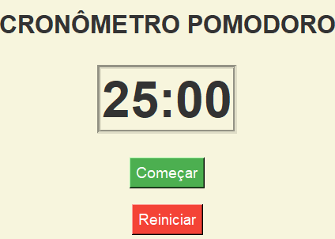

# Cronômetro Pomodoro

Este é um aplicativo de cronômetro Pomodoro desenvolvido em Python usando a biblioteca Tkinter. Ele ajuda a gerenciar o tempo de trabalho e pausas com base na técnica Pomodoro, promovendo foco e produtividade.

## Funcionalidades

- **Ciclos de Trabalho e Pausa**:
  - 25 minutos de trabalho.
  - 5 minutos de pausa curta.
  - 15 minutos de pausa longa após 4 ciclos de trabalho.

- **Interface Gráfica**:
  - Interface simples e intuitiva com botões animados.

- **Mensagens de Alerta**:
  - Notificações ao final de cada ciclo.

- **Botões Interativos**:
  - Botões "Começar" e "Reiniciar" com animações de hover.

## Requisitos

- **Python 3.x**
- **Tkinter** pip install tk

 ## Capturas de Tela

### Tela Inicial


### Cronômetro em Execução


## Como Usar

### Clone o Repositório ou baixe para executar o exe:

```bash
git clone https://github.com/EnukNogueira/pomodoro.git
Execute o programa: python pomodoro.py

Se você deseja executar o programa como um arquivo .exe (sem precisar do Python instalado), siga os passos abaixo:

1. Como acessar o arquivo executável:
O arquivo .exe já foi gerado e está disponível na seguinte pasta:

Caminho: dist/pomodoro.exe

2. Clique duas vezes no arquivo pomodoro.exe para executar o programa. O cronômetro será iniciado e exibido em uma janela gráfica.

Caso encontre algum problema ao executar o arquivo, verifique se todos os arquivos necessários estão presentes na mesma pasta ou entre em contato comigo.

Autor
Este projeto foi desenvolvido por Enuk como parte de um estudo sobre Python e interfaces gráficas.

